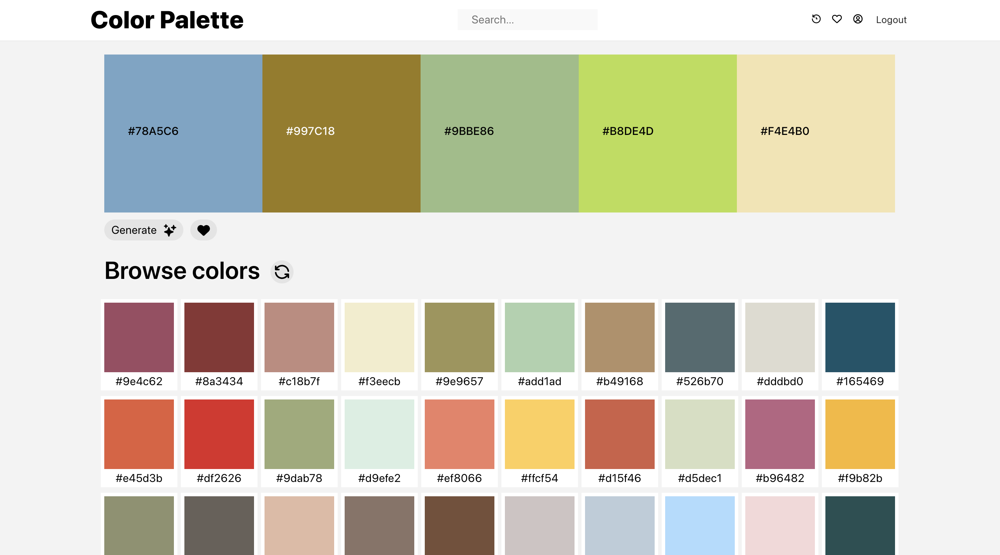
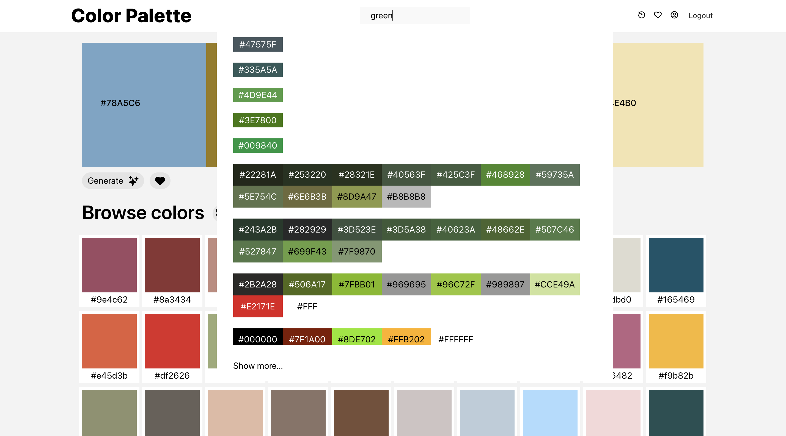
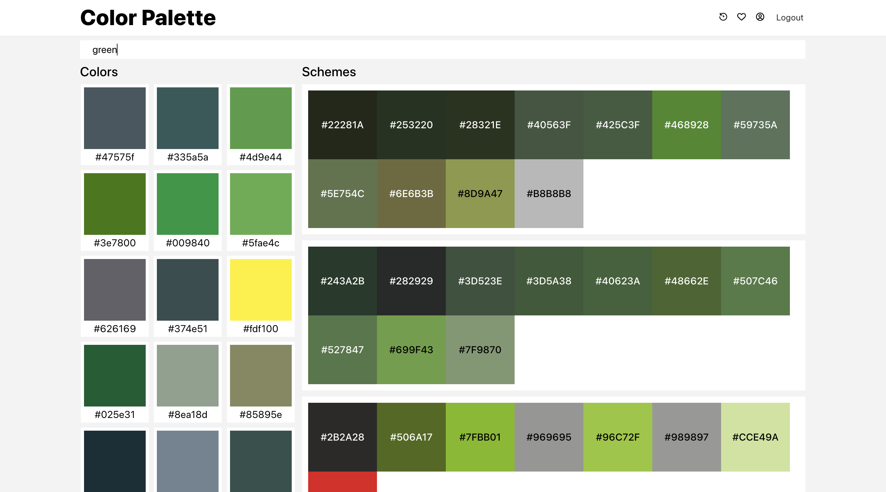
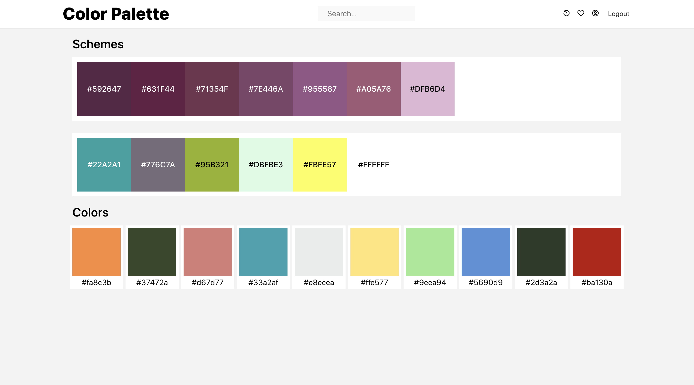
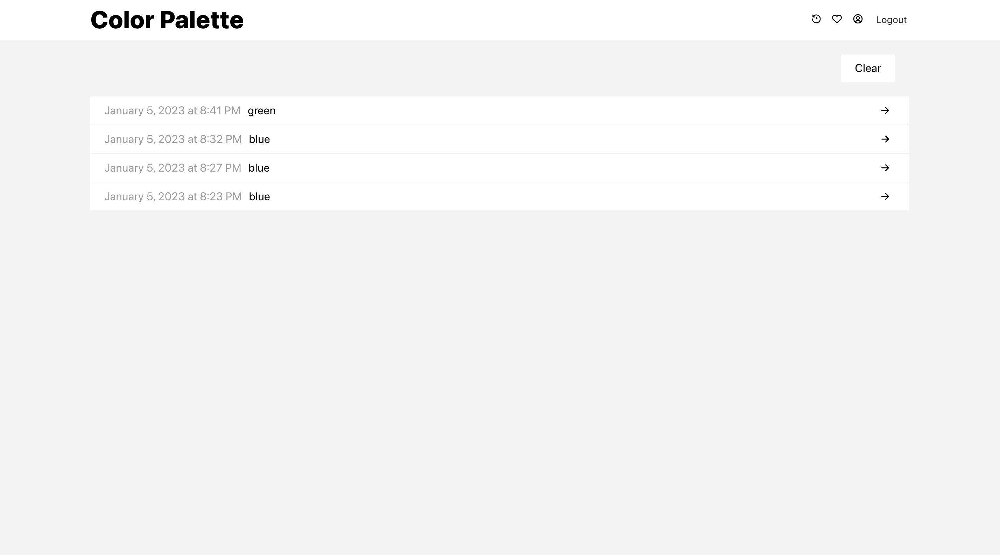
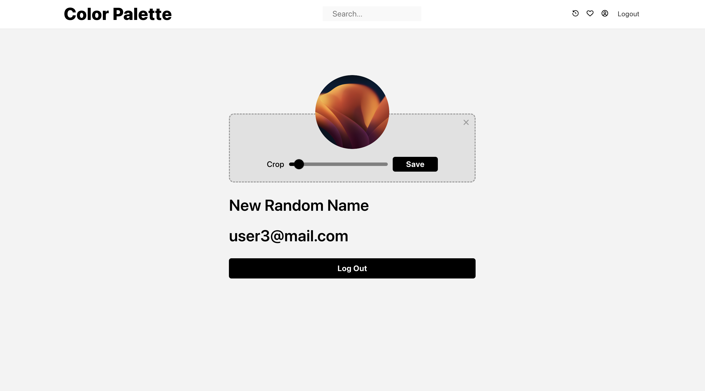

# Color Palette

## Install

```sh
# from root folder
npm install
```

```sh
# from client folder
cd client
npm install
```

## Run

```sh
# from root folder
npm run dev
```

## Main Page



## Search feature



## Search Page



## Favorites Page



## History Page



## User Page


